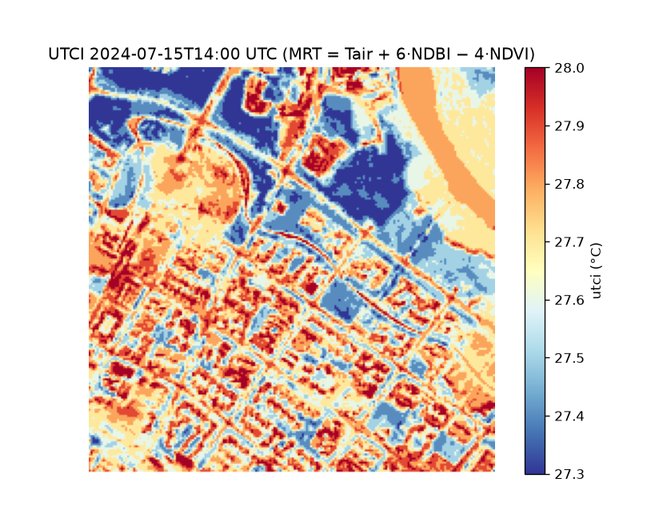

uc.climate.utci
===============

Urban question
--------------

How hot does the outdoor thermal environment feel?

Real case
---------

- Dataset: ``climate``
- Domain: climate
- Extra: ``urbancode[climate]``
- Offline: True

Command
-------

.. code-block:: python

   uc.climate.utci(...)

Inputs
------

air temperature, humidity, wind, radiant temperature

Spatial support
---------------

Native support: climate raster or point field. Analysis-unit means are a fusion step.

Parameters
----------

``air_temperature``, ``mean_radiant_temperature``, ``wind_speed``, ``relative_humidity``. MRT defaults to air temperature if omitted and is then flagged as assumed.

Method
------

UTCI from observed T/RH/wind and modelled mean radiant temperature.

Backend: ``pythermalcomfort``. Output unit: ``degree_celsius``.

Output
------

Raster Layer ``utci`` in °C.

Figure
------

   Output of ``uc.climate.utci`` on dataset ``climate``.
   Unit: degree_celsius. Backend: pythermalcomfort.

How to read
-----------

Do not read this as a measured outdoor campaign.

Parameters and sensitivity
--------------------------

A spatial MRT proxy changes the map; a point weather field does not.

Failure modes
-------------

Missing extra ``climate`` raises MissingExtraError.

Limitations
-----------

- mean radiant temperature is modelled, not measured
- weather is one archive timestamp, not a climate normal

Complete script
---------------

.. literalinclude:: ../../../../../examples/recipes/climate/utci_real.py
   :language: python
   :caption: examples/recipes/climate/utci_real.py

Related pages
-------------

- Domain: :doc:`/domains/climate`
- API: :doc:`/reference/api/climate`
- Workflow: :doc:`/workflows/heat_exposure`
- Dataset: :doc:`/reference/datasets`
- Catalog: :doc:`/reference/capabilities`
