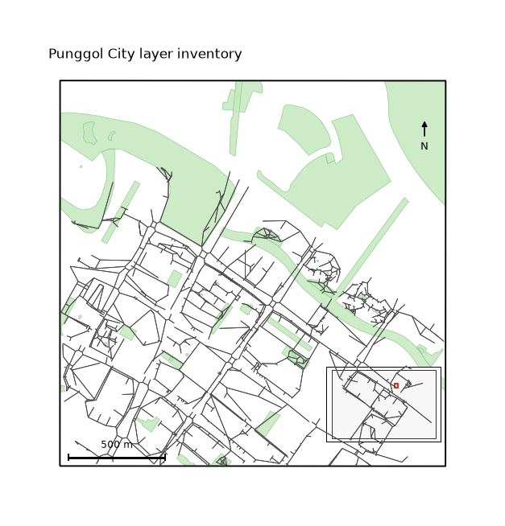

uc.load
=======

Urban question
--------------

Can this City directory be loaded without re-fetching?

Real case
---------

- Dataset: ``punggol``
- Domain: vector
- Extra: ``urbancode[vector]``
- Offline: True

Command
-------

.. code-block:: python

   uc.load(...)

Inputs
------

City directory

Spatial support
---------------

Native support: OSM footprints, parks, and points. Do not aggregate before the vector map is shown.

Parameters
----------

``path`` to a City directory. ``layers`` optional. ``lazy=True`` avoids opening rasters.

Method
------

Reads a City directory. lazy=True copies source files on save without opening rasters first.

Backend: ``geopandas``. Output unit: ``mixed``.

Output
------

City with Layer inventory, CRS, and stamps.

Figure
------

   Output of ``uc.load`` on dataset ``punggol``.
   Unit: mixed. Backend: geopandas.

How to read
-----------

The map is the layer inventory, not a new download.

Parameters and sensitivity
--------------------------

lazy=True copies files on save without decoding rasters first.

Failure modes
-------------

Missing manifest raises. Unknown layer names raise.

Limitations
-----------

- lazy load defers raster and graph reads until a layer is used
- the directory must include manifest.json

Complete script
---------------

.. literalinclude:: ../../../../../examples/recipes/core/city_roundtrip_punggol.py
   :language: python
   :caption: examples/recipes/core/city_roundtrip_punggol.py

Related pages
-------------

- Domain: :doc:`/domains/vector`
- API: :doc:`/reference/api/city`
- Workflow: :doc:`/workflows/punggol_urban_profile`
- Dataset: :doc:`/reference/datasets`
- Catalog: :doc:`/reference/capabilities`
