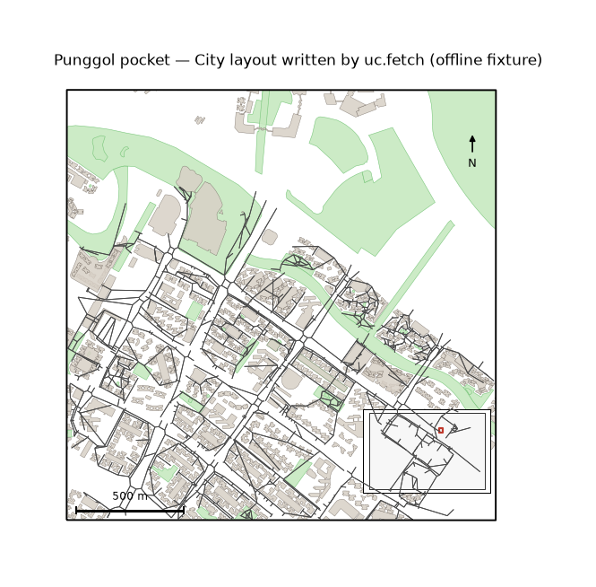

uc.fetch
========

Urban question
--------------

Which OSM and imagery layers cover this place?

Real case
---------

- Dataset: ``punggol``
- Domain: vector
- Extra: ``urbancode[network]``
- Offline: True

Command
-------

.. code-block:: python

   uc.fetch(...)

Inputs
------

place or bbox

Spatial support
---------------

Native support: OSM footprints, parks, and points. Do not aggregate before the vector map is shown.

Parameters
----------

``place`` or bbox plus modality presets. ``on_error`` can keep partial success.

Method
------

Live fetch writes a City directory from OSM and STAC. This page uses the committed pocket.

Backend: ``osmnx``. Output unit: ``mixed``.

Output
------

City directory. This recipe uses the committed pocket, not a live Overpass call.

Figure
------

   Output of ``uc.fetch`` on dataset ``punggol``.
   Unit: mixed. Backend: osmnx.

How to read
-----------

Treat the figure as the output contract of uc.fetch, not a live Overpass result.

Parameters and sensitivity
--------------------------

Live OSM and STAC change daily; the figure is the fixture.

Failure modes
-------------

Network errors raise unless ``on_error`` swallows them.

Limitations
-----------

- the offline recipe plots the committed pocket, not a live download
- live refresh is a Tier 2 network job

Complete script
---------------

.. literalinclude:: ../../../../../examples/recipes/core/fetch_punggol.py
   :language: python
   :caption: examples/recipes/core/fetch_punggol.py

Related pages
-------------

- Domain: :doc:`/domains/vector`
- API: :doc:`/reference/api/city`
- Workflow: :doc:`/workflows/punggol_urban_profile`
- Dataset: :doc:`/reference/datasets`
- Catalog: :doc:`/reference/capabilities`
