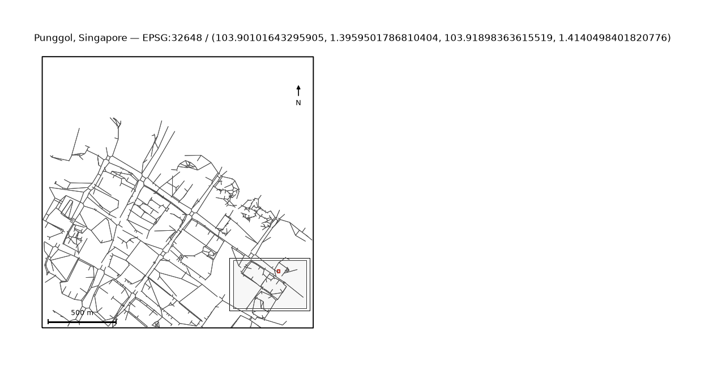

uc.StudyArea.from_bbox
======================

Urban question
--------------

What is the study boundary and canonical metric CRS?

Real case
---------

- Dataset: ``punggol``
- Domain: vector
- Extra: ``urbancode[vector]``
- Offline: True

Command
-------

.. code-block:: python

   uc.StudyArea.from_bbox(...)

Inputs
------

west south east north

Spatial support
---------------

Native support: OSM footprints, parks, and points. Do not aggregate before the vector map is shown.

Parameters
----------

``xmin, ymin, xmax, ymax`` in lon/lat. Optional ``place`` and ``city_id``.

Method
------

StudyArea.from_bbox stores lon/lat and derives a metric CRS from the centre.

Backend: ``pyproj``. Output unit: ``CRS``.

Output
------

StudyArea with geographic CRS, metric CRS, and bbox.

Figure
------

   Output of ``uc.StudyArea.from_bbox`` on dataset ``punggol``.
   Unit: CRS. Backend: pyproj.

How to read
-----------

The envelope is the 2 km pocket, not the municipal boundary.

Parameters and sensitivity
--------------------------

Metric CRS is derived from the centre, not from a national grid name.

Failure modes
-------------

Inverted bbox raises.

Limitations
-----------

- four numbers outside the geographic range are not treated as lon/lat
- the committed pocket is a 2 km extract, not the municipal boundary

Complete script
---------------

.. literalinclude:: ../../../../../examples/recipes/core/study_area_punggol.py
   :language: python
   :caption: examples/recipes/core/study_area_punggol.py

Related pages
-------------

- Domain: :doc:`/domains/vector`
- API: :doc:`/reference/api/city`
- Workflow: :doc:`/workflows/punggol_urban_profile`
- Dataset: :doc:`/reference/datasets`
- Catalog: :doc:`/reference/capabilities`
