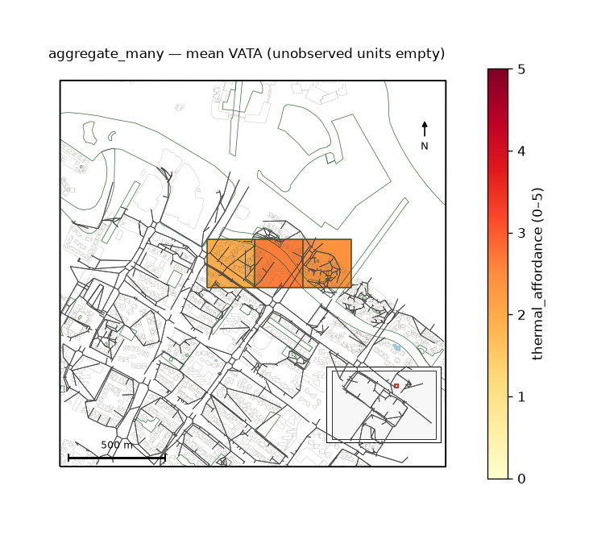

uc.fusion.aggregate_many
========================

Urban question
--------------

How do many perception columns become one indicator table?

Real case
---------

- Dataset: ``streetview``
- Domain: fusion
- Extra: ``urbancode[vector]``
- Offline: True

Command
-------

.. code-block:: python

   uc.fusion.aggregate_many(...)

Inputs
------

A prediction Layer, AnalysisUnits, and a column map.

Spatial support
---------------

Output support: AnalysisUnits. Units with no photos stay null.

Parameters
----------

``columns`` maps a source column to ``indicator`` and ``unit``.
``stat`` defaults to ``mean``.

Method
------

Calls ``aggregate`` once per column, then ``combine``. Users do not
write twenty separate aggregates.

Backend: ``geopandas``. Output unit: ``mixed``.

Output
------

One ``IndicatorResult`` with one row per city / unit / indicator,
plus coverage, quality flags, and parent receipts.

Figure
------

   Mean ``thermal_affordance`` after ``aggregate_many``. Unobserved
   units are empty, not zero.

How to read
-----------

Read the value with coverage. A high mean on one photo is thin.

Parameters and sensitivity
--------------------------

``mean`` vs ``median`` moves cells that contain one outlier photo.
Cell size changes which photos share a unit (MAUP).

Failure modes
-------------

An empty ``columns`` map raises. Unknown source columns yield
empty values, not invented scores.

Limitations
-----------

- each column is aggregated separately, then combined
- units with no photos stay null, not zero

Complete script
---------------

.. literalinclude:: ../../../../../examples/recipes/fusion/aggregate_many_punggol.py
   :language: python
   :caption: examples/recipes/fusion/aggregate_many_punggol.py

Related pages
-------------

- Domain: :doc:`/domains/fusion`
- API: :doc:`/reference/api/fusion`
- Workflow: :doc:`/workflows/research_cases/thermal_comfort_in_sight`
- Dataset: :doc:`/reference/datasets`
- Catalog: :doc:`/reference/capabilities`
