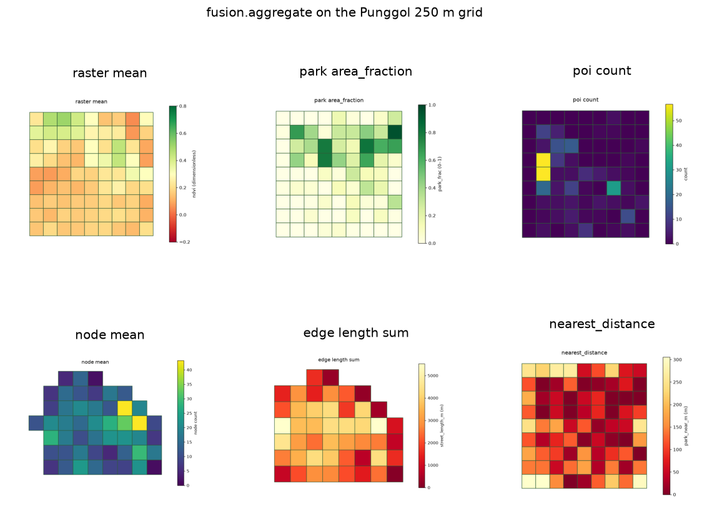

uc.fusion.aggregate
===================

Urban question
--------------

What does each analysis unit receive from this layer?

Real case
---------

- Dataset: ``punggol``
- Domain: fusion
- Extra: ``urbancode[vector]``
- Offline: True

Command
-------

.. code-block:: python

   uc.fusion.aggregate(...)

Inputs
------

Layer plus AnalysisUnits

Spatial support
---------------

Output support: AnalysisUnits (grid/hex/polygons). Context layers (streets, buildings, water) should remain visible.

Parameters
----------

``stat``: mean, min, max, median, p50, sum, count, weighted_mean, coverage, area_fraction, length_density, presence, nearest_distance.

``indicator``: output name. ``column``: vector/graph value column.

Method
------

Summarize a Layer onto AnalysisUnits. Missing stays null.

Backend: ``geopandas``. Output unit: ``stat-dependent``.

Output
------

IndicatorResult with value, coverage, unit, quality_flags, provenance.

Figure
------

   Output of ``uc.fusion.aggregate`` on dataset ``punggol``.
   Unit: stat-dependent. Backend: geopandas.

How to read
-----------

Read value together with coverage: a high value on low coverage is thin.

Parameters and sensitivity
--------------------------

Changing units (100 m vs 250 m) moves means (MAUP).

Failure modes
-------------

Unknown stat raises. Mixed geometry types can break overlay.

Limitations
-----------

- coverage is the fraction of the unit that intersected the source
- missing stays null, not zero

Complete script
---------------

.. literalinclude:: ../../../../../examples/recipes/fusion/aggregate_punggol.py
   :language: python
   :caption: examples/recipes/fusion/aggregate_punggol.py

Related pages
-------------

- Domain: :doc:`/domains/fusion`
- API: :doc:`/reference/api/fusion`
- Workflow: :doc:`/workflows/punggol_urban_profile`
- Dataset: :doc:`/reference/datasets`
- Catalog: :doc:`/reference/capabilities`
