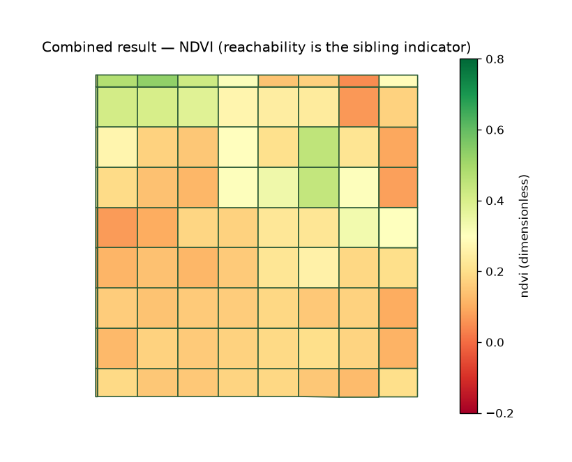

uc.fusion.combine
=================

Urban question
--------------

Can two indicator tables share the same units?

Real case
---------

- Dataset: ``punggol``
- Domain: fusion
- Extra: ``urbancode[vector]``
- Offline: True

Copy this
---------

.. code-block:: python

   import urbancode as uc

   city = uc.load("examples/data/real/punggol", lazy=True)
   units = uc.units.grid(city, cell_size=250)
   ndvi = uc.fusion.aggregate(
       uc.imagery.ndvi(city.layers["sentinel2"]),
       units,
       stat="mean",
       indicator="ndvi",
   )
   reach = uc.fusion.aggregate(
       uc.network.accessibility(
           city["streets"], radius=150, metric="reachability"
       ),
       units,
       stat="mean",
       indicator="reachability",
   )
   result = uc.fusion.combine(units, ndvi, reach)
   result.plot(indicator="ndvi")

``ndvi`` and ``reach`` are already aggregated IndicatorResults on the same ``units``. ``result`` concatenates their records; ``combine`` does not resample either source.

The figure below is the output for the committed fixture. Live-source
recipes can return different timestamps or inventories.

   Output of ``uc.fusion.combine`` on dataset ``punggol``.
   Unit: mixed. Backend: pandas.

Inputs
------

IndicatorResult plus AnalysisUnits

Spatial support
---------------

Output support: AnalysisUnits (grid/hex/polygons). Context layers (streets, buildings, water) should remain visible.

Parameters
----------

Two or more IndicatorResults. They must share city_id, units, CRS, and scheme.

Method
------

Concatenates IndicatorResults that share city_id, units, CRS, and scheme.

Backend: ``pandas``. Output unit: ``mixed``.

Output
------

One long IndicatorResult. combine does not re-aggregate.

How to read
-----------

combine does not re-aggregate; mismatched units raise.

Parameters and sensitivity
--------------------------

Mismatched unit IDs raise; they are not silently outer-joined.

Failure modes
-------------

Different grids or CRS raise ContractError.

Limitations
-----------

- combine checks city_id, unit IDs, CRS, and scheme
- it does not spatially re-aggregate

Related pages
-------------

- Domain: :doc:`/domains/fusion`
- API: :doc:`/reference/api/fusion`
- Workflow: :doc:`/workflows/punggol_urban_profile`
- Dataset: :doc:`/reference/datasets`
- Catalog: :doc:`/reference/capabilities`
