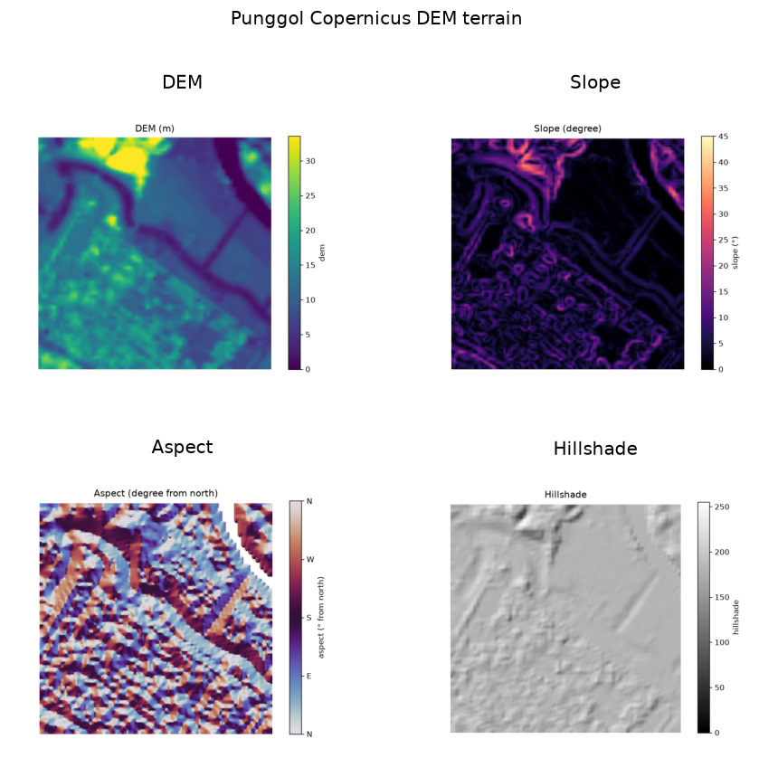

uc.imagery.aspect
=================

Urban question
--------------

Which way does the slope face?

Real case
---------

- Dataset: ``punggol``
- Domain: imagery
- Extra: ``urbancode[imagery]``
- Offline: True

Command
-------

.. code-block:: python

   uc.imagery.aspect(...)

Inputs
------

dem

Spatial support
---------------

Native support: raster pixels (10 m Sentinel-2 or 30 m DEM). Recipe figure is the native raster. Grid means appear only in fusion workflows.

Parameters
----------

DEM Layer. Aspect is clockwise from north. Flat cells are nodata.

Method
------

Aspect in degrees clockwise from north. Flat cells are nodata.

Backend: ``rasterio``. Output unit: ``degree``.

Output
------

Raster Layer ``aspect`` in degrees 0–360.

Figure
------

   Output of ``uc.imagery.aspect`` on dataset ``punggol``.
   Unit: degree. Backend: rasterio.

How to read
-----------

Use a cyclic reading: 0 and 360 are the same facing.

Parameters and sensitivity
--------------------------

A tiny slope change near flat can swing aspect by 180°.

Failure modes
-------------

Missing DEM raises. Use a cyclic colormap; 0 and 360 are the same facing.

Limitations
-----------

- cyclic 0-360 degrees from north
- flat cells are nodata

Complete script
---------------

.. literalinclude:: ../../../../../examples/recipes/imagery/aspect_punggol.py
   :language: python
   :caption: examples/recipes/imagery/aspect_punggol.py

Related pages
-------------

- Domain: :doc:`/domains/imagery`
- API: :doc:`/reference/api/imagery`
- Workflow: :doc:`/workflows/multi_city_comparison`
- Dataset: :doc:`/reference/datasets`
- Catalog: :doc:`/reference/capabilities`
