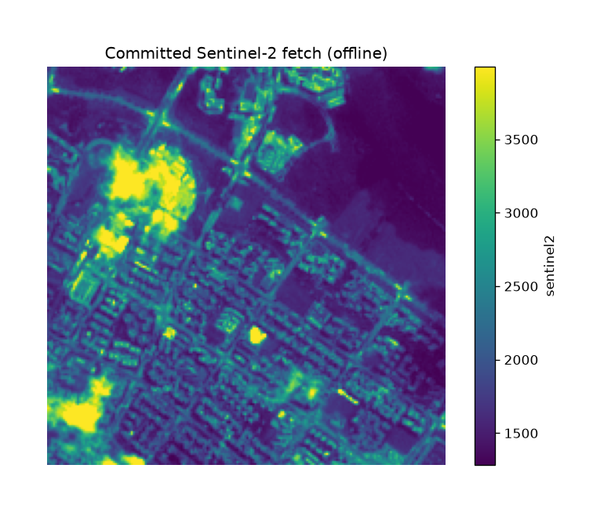

uc.imagery.fetch
================

Urban question
--------------

Which Sentinel-2 or DEM window covers this bbox?

Real case
---------

- Dataset: ``punggol``
- Domain: imagery
- Extra: ``urbancode[imagery]``
- Offline: True

Copy this
---------

.. code-block:: python

   import urbancode as uc

   # Live STAC search. The docs figure uses the committed GeoTIFF.
   city = uc.imagery.fetch(place="Punggol, Singapore")

``city`` is the live imagery result. The STAC item, acquisition date, cloud filter, and asset URLs are recorded in layer metadata; the figure below uses the pinned offline item instead.

The figure below is the output for the committed fixture. Live-source
recipes can return different timestamps or inventories.

   Output of ``uc.imagery.fetch`` on dataset ``punggol``.
   Unit: reflectance or metres. Backend: pystac-client.

Inputs
------

bbox and STAC search

Spatial support
---------------

Native support: raster pixels (10 m Sentinel-2 or 30 m DEM). Recipe figure is the native raster. Grid means appear only in fusion workflows.

Parameters
----------

``bbox`` or place, ``collection`` (Sentinel-2 L2A or DEM), ``datetime``, ``max_cloud``, ``max_pixels``.

Method
------

Live fetch searches Planetary Computer. This page uses the committed item.

Backend: ``pystac-client``. Output unit: ``reflectance or metres``.

Output
------

Raster Layer windowed to the bbox. Item ID and license are stamped.

How to read
-----------

Cloud cover and item ID are in the sidecar text, not inferred from the RGB.

Parameters and sensitivity
--------------------------

A different date or cloud threshold selects a different STAC item.

Failure modes
-------------

No item in the window raises. Pixel-budget overflow raises.

Limitations
-----------

- offline recipe uses the committed STAC item, not a live search
- live refresh is Tier 2

Related pages
-------------

- Domain: :doc:`/domains/imagery`
- API: :doc:`/reference/api/imagery`
- Workflow: :doc:`/workflows/punggol_urban_profile`
- Dataset: :doc:`/reference/datasets`
- Catalog: :doc:`/reference/capabilities`
