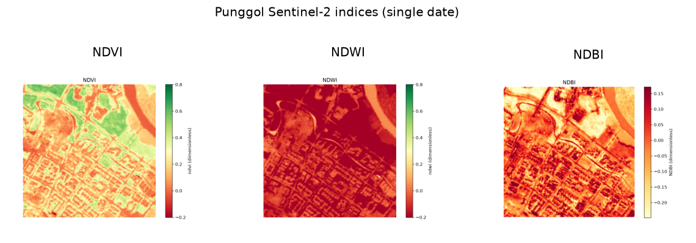

uc.imagery.ndvi
===============

Urban question
--------------

Where is vegetation concentrated?

Real case
---------

- Dataset: ``punggol``
- Domain: imagery
- Extra: ``urbancode[imagery]``
- Offline: True

Copy this
---------

.. code-block:: python

   import urbancode as uc

   city = uc.load("examples/data/real/punggol", lazy=True)
   ndvi = uc.imagery.ndvi(city.layers["sentinel2"])
   ndvi.plot()

``ndvi`` is a dimensionless raster :class:`~urbancode.city.Layer` on the Sentinel-2 pixel grid. ``ndvi.plot()`` shows pixels, not 250 m analysis units.

The figure below is the output for the committed fixture. Live-source
recipes can return different timestamps or inventories.

   Output of ``uc.imagery.ndvi`` on dataset ``punggol``.
   Unit: dimensionless. Backend: rasterio.

Inputs
------

sentinel2

Spatial support
---------------

Native support: 10 m raster pixels. Recipe figure: native raster. Fusion support: 250 m mean NDVI only in fusion workflows.

Parameters
----------

``source``: Layer, GeoTIFF path, or named-band mapping.

``nodata``: default NaN. Bands must be named B08/NIR and B04/Red.

Method
------

NDVI = (NIR - red) / (NIR + red) using B08 and B04.

Backend: ``rasterio``. Output unit: ``dimensionless``.

Output
------

Raster Layer ``ndvi``. Formula (B08 − B04) / (B08 + B04). Unit dimensionless. Resolution follows the source (10 m here).

How to read
-----------

High values are greener canopies on this date only.

Parameters and sensitivity
--------------------------

A different date or cloud mask changes the map more than the formula.

Failure modes
-------------

Missing B04 or B08 raises KeyError. No silent band-position fallback.

Limitations
-----------

- single acquisition date
- residual cloud and atmospheric effects

Related pages
-------------

- Domain: :doc:`/domains/imagery`
- API: :doc:`/reference/api/imagery`
- Workflow: :doc:`/workflows/punggol_urban_profile`
- Dataset: :doc:`/reference/datasets`
- Catalog: :doc:`/reference/capabilities`
