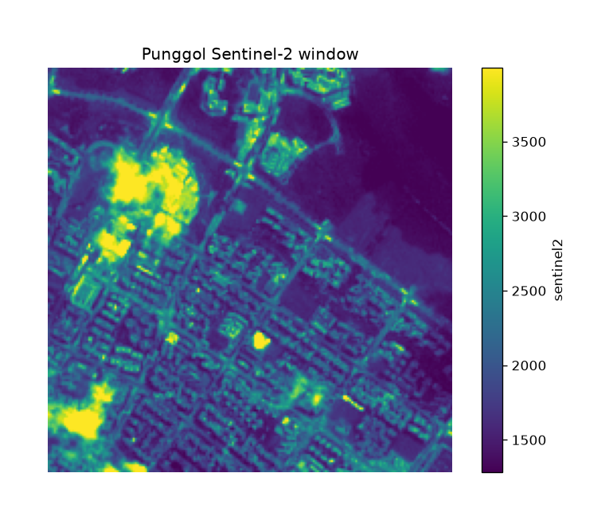

uc.imagery.read
===============

Urban question
--------------

What is on this GeoTIFF, and how is it georeferenced?

Real case
---------

- Dataset: ``punggol``
- Domain: imagery
- Extra: ``urbancode[imagery]``
- Offline: True

Command
-------

.. code-block:: python

   uc.imagery.read(...)

Inputs
------

GeoTIFF

Spatial support
---------------

Native support: raster pixels (10 m Sentinel-2 or 30 m DEM). Recipe figure is the native raster. Grid means appear only in fusion workflows.

Parameters
----------

``source`` is a GeoTIFF path or Layer. Nodata follows the file tags.

Method
------

Opens a local GeoTIFF with rasterio/rioxarray and records CRS, bands, nodata.

Backend: ``rasterio``. Output unit: ``source units``.

Output
------

Raster Layer with CRS, transform, band names, and nodata in metadata.

Figure
------

   Output of ``uc.imagery.read`` on dataset ``punggol``.
   Unit: source units. Backend: rasterio.

How to read
-----------

The preview is a rendering, not a reflectance product.

Parameters and sensitivity
--------------------------

Opening a different overview level changes the preview, not the values.

Failure modes
-------------

Missing file raises. Missing ``imagery`` extra raises MissingExtraError.

Limitations
-----------

- preview is not a radiometric product
- band names come from the fixture metadata

Complete script
---------------

.. literalinclude:: ../../../../../examples/recipes/imagery/read_punggol.py
   :language: python
   :caption: examples/recipes/imagery/read_punggol.py

Related pages
-------------

- Domain: :doc:`/domains/imagery`
- API: :doc:`/reference/api/imagery`
- Workflow: :doc:`/workflows/punggol_urban_profile`
- Dataset: :doc:`/reference/datasets`
- Catalog: :doc:`/reference/capabilities`
