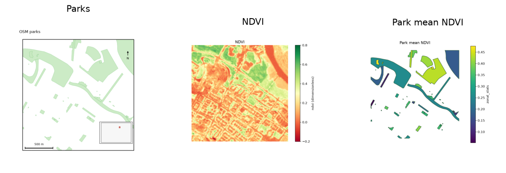

uc.imagery.zonal_stats
======================

Urban question
--------------

What is the mean NDVI inside each park polygon?

Real case
---------

- Dataset: ``punggol``
- Domain: imagery
- Extra: ``urbancode[imagery]``
- Offline: True

Command
-------

.. code-block:: python

   uc.imagery.zonal_stats(...)

Inputs
------

raster plus parks

Spatial support
---------------

Native support: raster pixels (10 m Sentinel-2 or 30 m DEM). Recipe figure is the native raster. Grid means appear only in fusion workflows.

Parameters
----------

``raster`` plus polygon ``zones``. Statistic default mean. Zones are reprojected onto the raster CRS.

Method
------

Mean NDVI inside each OSM park polygon.

Backend: ``rasterio``. Output unit: ``dimensionless``.

Output
------

Vector Layer with the statistic column and a coverage fraction.

Figure
------

   Output of ``uc.imagery.zonal_stats`` on dataset ``punggol``.
   Unit: dimensionless. Backend: rasterio.

How to read
-----------

A high park mean is greener foliage inside that polygon on this date.

Parameters and sensitivity
--------------------------

Small parks relative to 10 m pixels have low coverage.

Failure modes
-------------

Empty zones raise. CRS mismatch is reprojected, not silently ignored.

Limitations
-----------

- park polygons are OSM leisure/natural tags
- mean ignores within-park structure

Complete script
---------------

.. literalinclude:: ../../../../../examples/recipes/imagery/zonal_stats_punggol.py
   :language: python
   :caption: examples/recipes/imagery/zonal_stats_punggol.py

Related pages
-------------

- Domain: :doc:`/domains/imagery`
- API: :doc:`/reference/api/imagery`
- Workflow: :doc:`/workflows/punggol_urban_profile`
- Dataset: :doc:`/reference/datasets`
- Catalog: :doc:`/reference/capabilities`
