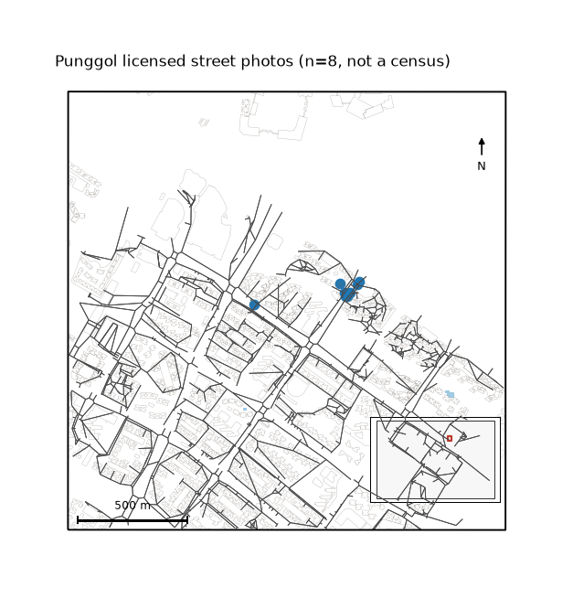

uc.images.from_table
====================

Urban question
--------------

How do geotagged city photos become an observation Layer?

Real case
---------

- Dataset: ``streetview``
- Domain: images
- Extra: ``urbancode[vector]``
- Offline: True

Command
-------

.. code-block:: python

   uc.images.from_table(...)

Inputs
------

Table with unique ``image_id``, image path or URI, and lon/lat.

Spatial support
---------------

Native support: geotagged observation point. This is not a satellite
raster and not a street-view download.

Parameters
----------

``id_column`` must identify each photo. Automatic IDs are allowed
only with ``id_strategy="uri_hash"`` or ``"checksum"``.
``view_type`` is ``streetview``, ``windowview``, or ``ground_photo``.

Method
------

Builds a point Layer and stamps provenance. Window-view rows stay
on this contract; they are not street view.

Backend: ``geopandas``. Output unit: ``image``.

Output
------

Point Layer with ``image_id``, path/URI, ``view_type``, ``source``,
``license``, ``captured_at``, and ``location_quality``.

Figure
------

   Output of ``uc.images.from_table`` on eight Commons photos.
   Spatial support: points. n=8, not a census.

How to read
-----------

Each point is one photo. Several photos can share a location.
Do not treat the set as a complete street inventory.

Parameters and sensitivity
--------------------------

Dropping ``image_id`` and inventing IDs from geometry would merge
distinct photos. That is rejected.

Failure modes
-------------

Duplicate ``image_id`` raises. Unknown ``view_type`` raises.
Missing path and missing ``image_id`` raise.

Limitations
-----------

- image_id must be unique; one location can have several photos
- window-view photos use view_type=windowview, not streetview

Complete script
---------------

.. literalinclude:: ../../../../../examples/recipes/images/from_table_punggol.py
   :language: python
   :caption: examples/recipes/images/from_table_punggol.py

Related pages
-------------

- Concept: :doc:`/concepts/image_observations`
- API: :doc:`/reference/api/images`
- Workflow: :doc:`/workflows/research_cases/thermal_comfort_in_sight`
- Dataset: :doc:`/reference/datasets`
- Catalog: :doc:`/reference/capabilities`
