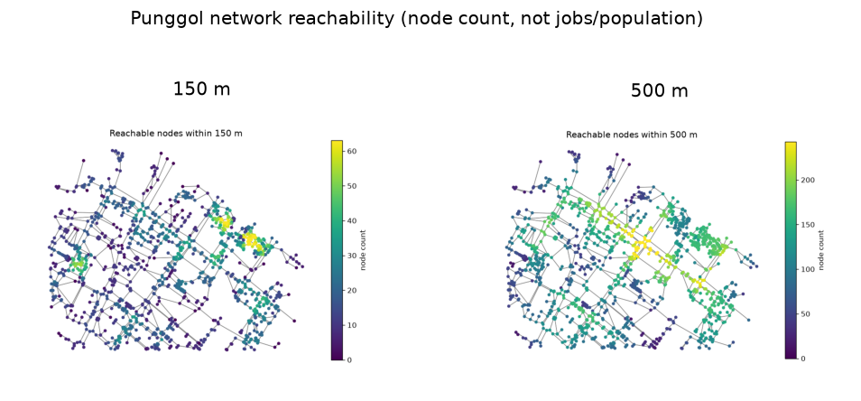

uc.network.accessibility
========================

Urban question
--------------

How many other street nodes can you reach within a walk distance?

Real case
---------

- Dataset: ``punggol``
- Domain: network
- Extra: ``urbancode[network]``
- Offline: True

Copy this
---------

.. code-block:: python

   import urbancode as uc

   city = uc.load("examples/data/real/punggol", lazy=True)
   reach = uc.network.accessibility(
       city["streets"], radius=150, metric="reachability"
   )
   reach.plot()

``reach`` is a graph :class:`~urbancode.city.Layer`. Each node gets a ``reachability`` count of other nodes within 150 m of network length; ``reach.plot()`` stays on graph nodes rather than grid cells.

The figure below is the output for the committed fixture. Live-source
recipes can return different timestamps or inventories.

   Output of ``uc.network.accessibility`` on dataset ``punggol``.
   Unit: count. Backend: networkx.

Inputs
------

streets graph

Spatial support
---------------

Native support: network nodes. Recipe figure: nodes/edges on the street graph. Fusion support: optional 250 m grid after ``uc.fusion.aggregate``.

Parameters
----------

``radius`` (float, required): graph-length cutoff in the same units as ``weight`` (metres on OSM walk graphs).

``metric`` (str, default ``reachability``): only ``reachability`` is implemented.

``weight`` (str, default ``length``): edge attribute used as distance. Missing lengths are filled from geometry when present.

Method
------

Reachability counts other graph nodes within a length cutoff.

Backend: ``networkx``. Output unit: ``count``.

Output
------

Graph Layer. Node attribute ``reachability`` is a count of other nodes reachable within ``radius``. Unit: count. CRS is the source graph CRS (usually EPSG:4326); metric work happens on edge lengths, not degrees.

How to read
-----------

Read this as network reachability, never as jobs or population access.

Parameters and sensitivity
--------------------------

150 m vs 500 m raises node counts and flattens local contrast. A 2 km pocket truncates paths that would continue outside the box.

Failure modes
-------------

Unknown ``metric`` raises. Negative ``radius`` raises. Disconnected components simply cannot reach each other.

Limitations
-----------

- this is network reachability (node count), not population or jobs access
- radius is graph length, not a door-to-door walk

Related pages
-------------

- Domain: :doc:`/domains/network`
- API: :doc:`/reference/api/network`
- Workflow: :doc:`/workflows/green_accessibility`
- Dataset: :doc:`/reference/datasets`
- Catalog: :doc:`/reference/capabilities`
