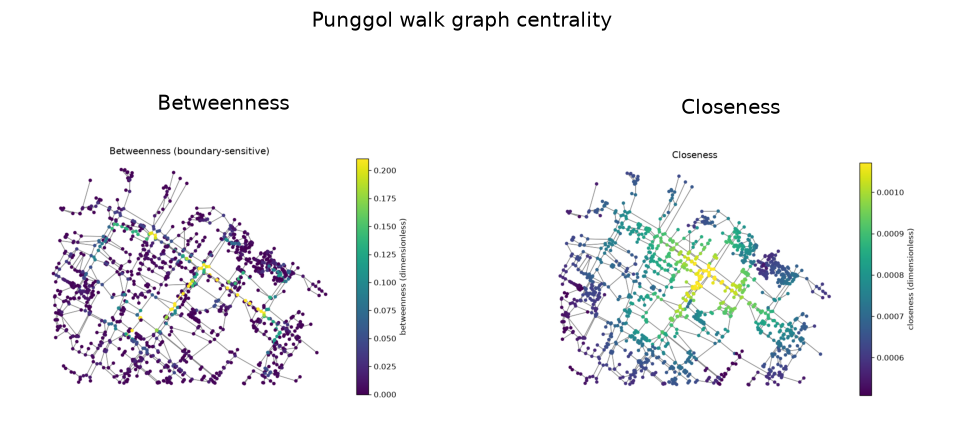

uc.network.centrality
=====================

Urban question
--------------

Which streets sit on many shortest paths, and which are close to others?

Real case
---------

- Dataset: ``punggol``
- Domain: network
- Extra: ``urbancode[network]``
- Offline: True

Command
-------

.. code-block:: python

   uc.network.centrality(...)

Inputs
------

streets graph

Spatial support
---------------

Native support: street graph nodes/edges. Recipe figure shows the graph. Fusion to a 250 m grid is optional and only after ``uc.fusion.aggregate``.

Parameters
----------

``metric``: ``betweenness`` or ``closeness``.

``radius``: optional distance cutoff in ``weight`` units.

``weight``: default ``length``.

Method
------

Betweenness uses Brandes with an optional radius. Closeness is inverse farness.

Backend: ``networkx``. Output unit: ``dimensionless``.

Output
------

Graph Layer with node attribute ``betweenness`` or ``closeness`` (dimensionless).

Figure
------

   Output of ``uc.network.centrality`` on dataset ``punggol``.
   Unit: dimensionless. Backend: networkx.

How to read
-----------

High betweenness near the pocket edge is often a boundary effect, not a CBD.

Parameters and sensitivity
--------------------------

Unbounded betweenness on a clipped pocket is dominated by the cut boundary.

Failure modes
-------------

Unknown metric raises. Isolated nodes have closeness 0.

Limitations
-----------

- betweenness is sensitive to the pocket boundary
- values are graph-theoretic, not traffic volume

Complete script
---------------

.. literalinclude:: ../../../../../examples/recipes/network/centrality_punggol.py
   :language: python
   :caption: examples/recipes/network/centrality_punggol.py

Related pages
-------------

- Domain: :doc:`/domains/network`
- API: :doc:`/reference/api/network`
- Workflow: :doc:`/workflows/punggol_urban_profile`
- Dataset: :doc:`/reference/datasets`
- Catalog: :doc:`/reference/capabilities`
