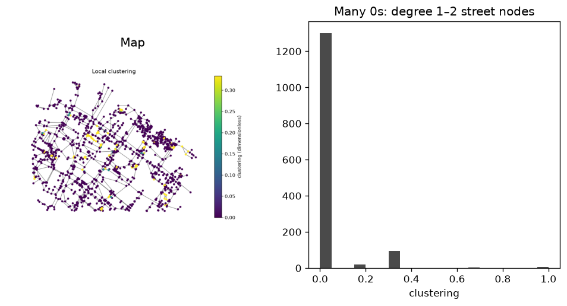

uc.network.clustering
=====================

Urban question
--------------

How tightly are neighbouring street nodes connected?

Real case
---------

- Dataset: ``punggol``
- Domain: network
- Extra: ``urbancode[network]``
- Offline: True

Copy this
---------

.. code-block:: python

   import urbancode as uc

   city = uc.load("examples/data/real/punggol", lazy=True)
   cluster = uc.network.clustering(city["streets"])
   cluster.plot()

``cluster`` is a graph :class:`~urbancode.city.Layer` whose nodes carry the dimensionless ``clustering`` coefficient. The plot is node-level.

The figure below is the output for the committed fixture. Live-source
recipes can return different timestamps or inventories.

   Output of ``uc.network.clustering`` on dataset ``punggol``.
   Unit: dimensionless. Backend: networkx.

Inputs
------

streets graph

Spatial support
---------------

Native support: street graph nodes/edges. Recipe figure shows the graph. Fusion to a 250 m grid is optional and only after ``uc.fusion.aggregate``.

Parameters
----------

``radius`` optional length cutoff. ``weight`` default ``length``. Computed on the undirected simple graph.

Method
------

Watts–Strogatz local clustering on the undirected walk graph.

Backend: ``networkx``. Output unit: ``dimensionless``.

Output
------

Graph Layer. Node attribute ``clustering`` (Watts–Strogatz, dimensionless).

How to read
-----------

Zeros are expected on degree-1 and degree-2 street nodes.

Parameters and sensitivity
--------------------------

Degree-1 and degree-2 nodes are often zero; that is expected.

Failure modes
-------------

Empty graphs raise. Isolated nodes get 0.

Limitations
-----------

- many degree-1 and degree-2 street nodes have clustering 0
- experimental Watts-Strogatz local definition

Related pages
-------------

- Domain: :doc:`/domains/network`
- API: :doc:`/reference/api/network`
- Workflow: :doc:`/workflows/punggol_urban_profile`
- Dataset: :doc:`/reference/datasets`
- Catalog: :doc:`/reference/capabilities`
