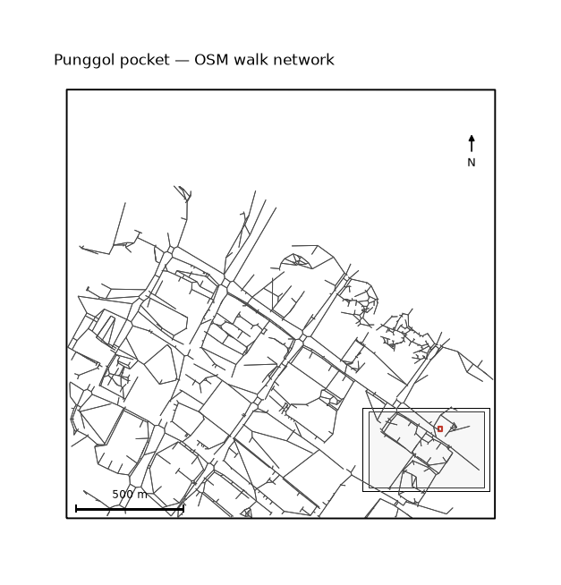

uc.network.fetch
================

Urban question
--------------

What street graph covers this study area?

Real case
---------

- Dataset: ``punggol``
- Domain: network
- Extra: ``urbancode[network]``
- Offline: True

Command
-------

.. code-block:: python

   uc.network.fetch(...)

Inputs
------

bbox or place

Spatial support
---------------

Native support: street graph nodes/edges. Recipe figure shows the graph. Fusion to a 250 m grid is optional and only after ``uc.fusion.aggregate``.

Parameters
----------

``place`` or ``bbox``. ``layers`` defaults to streets only; ``layers='all'`` is explicit. ``network_type`` follows OSMnx walk/drive.

Method
------

The committed graph is an OSM walk extract clipped to the pocket.

Backend: ``osmnx``. Output unit: ``graph``.

Output
------

City with graph and vector layers. CRS EPSG:4326 plus a metric CRS stamp.

Figure
------

   Output of ``uc.network.fetch`` on dataset ``punggol``.
   Unit: graph. Backend: osmnx.

How to read
-----------

Line density follows the street layout. This is not traffic volume.

Parameters and sensitivity
--------------------------

A 100 m bbox change can drop or add whole streets at the cut.

Failure modes
-------------

Live Overpass failures raise unless ``on_error`` is set on ``uc.fetch``.

Limitations
-----------

- committed pocket is a clipped OSM extract, not a live refresh
- OSM timestamp is the extract date, not a planning-grade inventory

Complete script
---------------

.. literalinclude:: ../../../../../examples/recipes/network/fetch_punggol.py
   :language: python
   :caption: examples/recipes/network/fetch_punggol.py

Related pages
-------------

- Domain: :doc:`/domains/network`
- API: :doc:`/reference/api/network`
- Workflow: :doc:`/workflows/punggol_urban_profile`
- Dataset: :doc:`/reference/datasets`
- Catalog: :doc:`/reference/capabilities`
