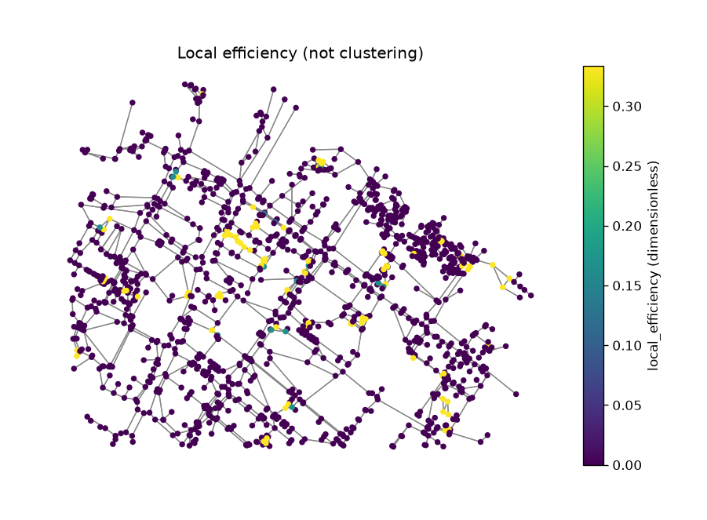

uc.network.local_efficiency
===========================

Urban question
--------------

How well do neighbours stay connected if a node is removed?

Real case
---------

- Dataset: ``punggol``
- Domain: network
- Extra: ``urbancode[network]``
- Offline: True

Command
-------

.. code-block:: python

   uc.network.local_efficiency(...)

Inputs
------

streets graph

Spatial support
---------------

Native support: street graph nodes/edges. Recipe figure shows the graph. Fusion to a 250 m grid is optional and only after ``uc.fusion.aggregate``.

Parameters
----------

``radius`` optional. Neighbour subgraphs use hop distance, not metres.

Method
------

Latora–Marchiori local efficiency among neighbours of each node.

Backend: ``networkx``. Output unit: ``dimensionless``.

Output
------

Graph Layer. Node attribute ``local_efficiency`` (Latora–Marchiori).

Figure
------

   Output of ``uc.network.local_efficiency`` on dataset ``punggol``.
   Unit: dimensionless. Backend: networkx.

How to read
-----------

High values mean neighbours stay connected if the node is removed.

Parameters and sensitivity
--------------------------

A radius cutoff changes which neighbours are considered.

Failure modes
-------------

Missing network extra raises. Isolated nodes get 0.

Limitations
-----------

- experimental Latora-Marchiori local efficiency
- not a congestion or travel-time measure

Complete script
---------------

.. literalinclude:: ../../../../../examples/recipes/network/local_efficiency_punggol.py
   :language: python
   :caption: examples/recipes/network/local_efficiency_punggol.py

Related pages
-------------

- Domain: :doc:`/domains/network`
- API: :doc:`/reference/api/network`
- Workflow: :doc:`/workflows/punggol_urban_profile`
- Dataset: :doc:`/reference/datasets`
- Catalog: :doc:`/reference/capabilities`
