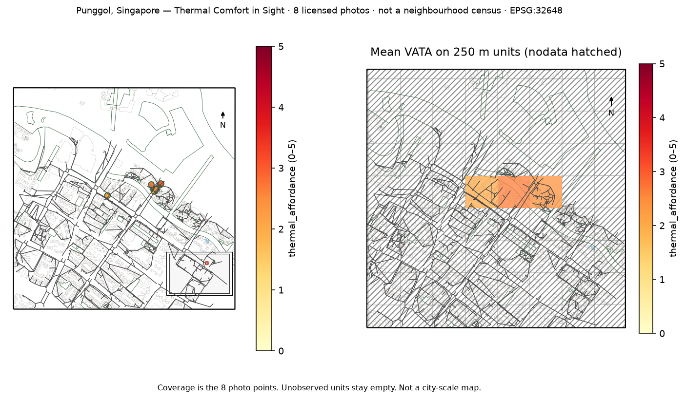

uc.perception.thermal_affordance
================================

Urban question
--------------

What visual thermal affordance does TCIS assign to these photos?

Real case
---------

- Dataset: ``streetview``
- Domain: perception
- Extra: ``urbancode[perception]``
- Offline: True

Copy this
---------

.. code-block:: python

   import pandas as pd
   import urbancode as uc

   catalog = pd.read_json("examples/data/real/streetview/catalog.json")
   photos = uc.images.from_table(
       catalog[catalog["city_id"] == "punggol"],
       view_type="streetview",
       image_root="examples/data/real/streetview",
   )
   vata = uc.perception.thermal_affordance(photos)
   vata.plot()

``photos`` is the geolocated input image layer. ``vata`` is a point :class:`~urbancode.city.Layer` with TCIS VATA/VPI model outputs attached to each successfully scored image.

The figure below is the output for the committed fixture. Live-source
recipes can return different timestamps or inventories.

   Output of ``uc.perception.thermal_affordance`` on dataset ``streetview``.
   Unit: score_0_5. Backend: torch.

Inputs
------

geolocated image Layer

Spatial support
---------------

See :doc:`/concepts/spatial_support_and_maps` for native vs aggregated geometry.

Parameters
----------

See the signature of ``uc.perception.thermal_affordance`` in the API reference. The recipe uses the committed fixture and does not hard-code result values.

Method
------

TCIS VATA and VPI heads as a Layer. Weights stay in the user cache.

Backend: ``torch``. Output unit: ``score_0_5``.

Output
------

point Layer. Unit: score_0_5.

How to read
-----------

thermal_affordance is visual affordance, not measured comfort and not UTCI.

Parameters and sensitivity
--------------------------

Change one parameter at a time (radius, cell size, date) and compare coverage.

Failure modes
-------------

Missing extras raise ``MissingExtraError``. Invalid parameters raise ``ValueError``.

Limitations
-----------

- VATA is visual thermal affordance, not measured comfort and not UTCI
- eight Commons photos are a tiny out-of-distribution fixture, not the flagship 92,233 Singapore result
- dataset-scale runs use output/chunk_size/resume on this same function

Related pages
-------------

- Domain: :doc:`/reference/api/perception`
- API: :doc:`/reference/api/perception`
- Workflow: :doc:`/workflows/research_cases/thermal_comfort_in_sight`
- Dataset: :doc:`/reference/datasets`
- Catalog: :doc:`/reference/capabilities`
