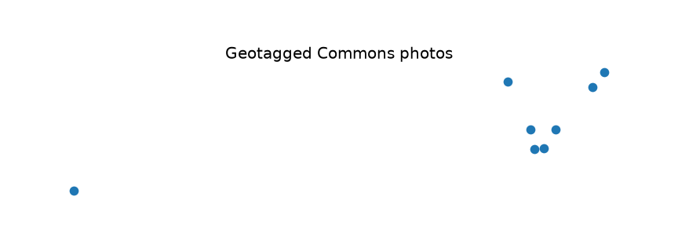

uc.svi.as_layer
===============

Urban question
--------------

Where do these photo observations sit on the map?

Real case
---------

- Dataset: ``streetview``
- Domain: streetview
- Extra: ``urbancode[vector]``
- Offline: True

Copy this
---------

.. code-block:: python

   import pandas as pd
   import urbancode as uc

   catalog = pd.read_json("examples/data/real/streetview/catalog.json")
   photos = uc.svi.as_layer(catalog[catalog["city_id"] == "punggol"])
   print(photos.kind, photos.metadata["n_images"])
   photos.plot()

``catalog`` is filtered to Punggol before conversion. ``photos`` is an eight-row point :class:`~urbancode.city.Layer`; rows without usable coordinates are not invented.

The figure below is the output for the committed fixture. Live-source
recipes can return different timestamps or inventories.

   Output of ``uc.svi.as_layer`` on dataset ``streetview``.
   Unit: point. Backend: geopandas.

Inputs
------

table with lon/lat

Spatial support
---------------

Native support: image and geotagged point. Grid means are used only when coverage is sufficient.

Parameters
----------

Table with lon/lat columns. Rows without coordinates are dropped.

Method
------

Builds a point Layer from lon/lat columns.

Backend: ``geopandas``. Output unit: ``point``.

Output
------

Point Layer. CRS EPSG:4326 unless given.

How to read
-----------

Only geotagged rows are observations. Illustrative points stay labelled.

Parameters and sensitivity
--------------------------

Illustrative (non-geotagged) points must stay labelled as such.

Failure modes
-------------

All-missing coordinates raise or return an empty layer.

Limitations
-----------

- only geotagged photos are real observations
- illustrative coordinates must stay labelled illustrative

Related pages
-------------

- Domain: :doc:`/domains/streetview`
- API: :doc:`/reference/api/streetview`
- Workflow: :doc:`/workflows/street_experience`
- Dataset: :doc:`/reference/datasets`
- Catalog: :doc:`/reference/capabilities`
