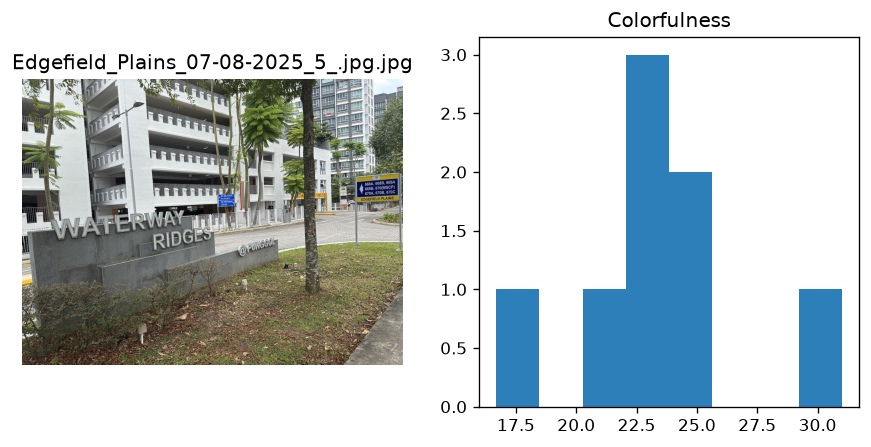

uc.streetview.color
===================

Urban question
--------------

How colourful are these street photos?

Real case
---------

- Dataset: ``streetview``
- Domain: streetview
- Extra: ``urbancode[streetview]``
- Offline: True

Command
-------

.. code-block:: python

   uc.streetview.color(...)

Inputs
------

image catalog

Spatial support
---------------

Native support: image and geotagged observation point. Fusion support: grid mean only when coverage is sufficient.

Parameters
----------

Catalog plus ``folder_path``. OpenCV Colorfulness and related pixel stats.

Method
------

OpenCV Colorfulness and related pixel statistics.

Backend: ``opencv``. Output unit: ``colorfulness``.

Output
------

DataFrame columns include Colorfulness. Unit is a pixel statistic.

Figure
------

   Output of ``uc.streetview.color`` on dataset ``streetview``.
   Unit: colorfulness. Backend: opencv.

How to read
-----------

High Colorfulness is a more saturated photo, not a comfort score.

Parameters and sensitivity
--------------------------

JPEG compression and crop change Colorfulness more than the formula.

Failure modes
-------------

Unreadable images are skipped or raise depending on OpenCV.

Limitations
-----------

- Colorfulness is a pixel statistic, not a comfort score
- camera processing affects the value

Complete script
---------------

.. literalinclude:: ../../../../../examples/recipes/streetview/color_punggol.py
   :language: python
   :caption: examples/recipes/streetview/color_punggol.py

Related pages
-------------

- Domain: :doc:`/domains/streetview`
- API: :doc:`/reference/api/streetview`
- Workflow: :doc:`/workflows/street_experience`
- Dataset: :doc:`/reference/datasets`
- Catalog: :doc:`/reference/capabilities`
