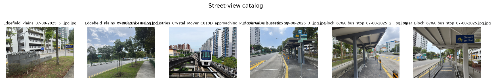

uc.streetview.filename
======================

Urban question
--------------

Which image files are in this folder?

Real case
---------

- Dataset: ``streetview``
- Domain: streetview
- Extra: ``urbancode[streetview]``
- Offline: True

Command
-------

.. code-block:: python

   uc.streetview.filename(...)

Inputs
------

image directory

Spatial support
---------------

Native support: image and geotagged point. Grid means are used only when coverage is sufficient.

Parameters
----------

``folder`` of image files. No model, no scores.

Method
------

Lists image files in a folder. No perception scores.

Backend: ``pandas``. Output unit: ``filename``.

Output
------

DataFrame with Filename and path. Not a spatial sample.

Figure
------

   Output of ``uc.streetview.filename`` on dataset ``streetview``.
   Unit: filename. Backend: pandas.

How to read
-----------

The contact sheet is the catalog, not a spatial sample.

Parameters and sensitivity
--------------------------

Hidden files are ignored; extension filter is image types.

Failure modes
-------------

Missing folder raises.

Limitations
-----------

- catalog only; no perception scores
- photo locations are recorded separately

Complete script
---------------

.. literalinclude:: ../../../../../examples/recipes/streetview/filename_punggol.py
   :language: python
   :caption: examples/recipes/streetview/filename_punggol.py

Related pages
-------------

- Domain: :doc:`/domains/streetview`
- API: :doc:`/reference/api/streetview`
- Workflow: :doc:`/workflows/street_experience`
- Dataset: :doc:`/reference/datasets`
- Catalog: :doc:`/reference/capabilities`
