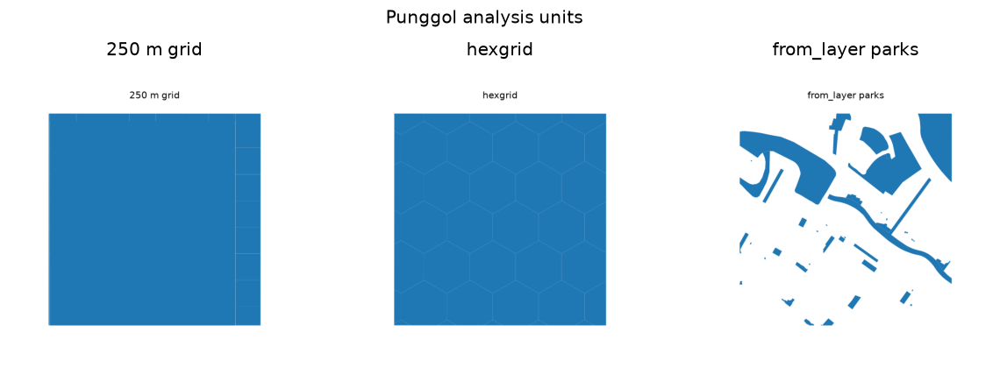

uc.units.from_layer
===================

Urban question
--------------

Can existing polygons become analysis units?

Real case
---------

- Dataset: ``punggol``
- Domain: units
- Extra: ``urbancode[vector]``
- Offline: True

Copy this
---------

.. code-block:: python

   import urbancode as uc

   city = uc.load("examples/data/real/punggol", lazy=True)
   units = uc.units.from_layer(
       city.layer("parks"), study_area=city.study_area
   )
   print(len(units.frame), units.kind)

``units`` is an :class:`~urbancode.units.AnalysisUnits` object built from park polygons. Its IDs fingerprint geometry; they are not copied row numbers.

The figure below is the output for the committed fixture. Live-source
recipes can return different timestamps or inventories.

   Output of ``uc.units.from_layer`` on dataset ``punggol``.
   Unit: polygon. Backend: geopandas.

Inputs
------

polygon Layer

Spatial support
---------------

Output support: AnalysisUnits. These are a comparison frame, not a replacement for streets or buildings.

Parameters
----------

``layer`` must be polygons. Optional ``id_column`` is not invented.

Method
------

Existing polygons become units. IDs are geometry fingerprints.

Backend: ``geopandas``. Output unit: ``polygon``.

Output
------

AnalysisUnits. IDs are geometry fingerprints unless a column is given.

How to read
-----------

Duplicate geometries raise; they are not row-number suffixed.

Parameters and sensitivity
--------------------------

Simplifying polygons changes IDs because they are fingerprints.

Failure modes
-------------

Duplicate geometries raise. Points and lines raise.

Limitations
-----------

- unit IDs are geometry fingerprints
- duplicate geometries raise

Related pages
-------------

- Domain: :doc:`/domains/units`
- API: :doc:`/reference/api/units`
- Workflow: :doc:`/workflows/punggol_urban_profile`
- Dataset: :doc:`/reference/datasets`
- Catalog: :doc:`/reference/capabilities`
